<div align="center">

# 🌾 AgroTech Intelligence Protocol

### Real-Time Agricultural Resource Management, Neural Allocation & Warehouse Optimization Platform


AgroTech is an enterprise-grade agricultural logistics protocol designed to standardize farm and warehouse operations through decentralized resource tracking, predictive inventory depletion modeling, smart crop allocation, and zero-latency WebSocket data synchronization.

---

[Getting Started](#-getting-started) · [Features](#-features) · [Architecture](#-system-architecture) · [AI Engine](#-ai--optimization-engine) · [Database](#-database-schema-erd) · [Security](#-security--compliance) · [API Docs](#-api-reference)

</div>

---

## 📑 Table of Contents

1. [System Architecture](#-system-architecture)
2. [UML Class Diagram](#-uml-class-diagram)
3. [Tech Stack](#-tech-stack)
4. [Getting Started](#-getting-started)
5. [Features](#-features)
6. [Role-Based Access Control (RBAC)](#-role-based-access-control-rbac)
7. [AI & Optimization Engine](#-ai--optimization-engine)
8. [Database Schema (ERD)](#-database-schema-erd)
9. [API Reference](#-api-reference)
10. [Security & Compliance](#-security--compliance)
11. [Design System](#-design-system)
12. [Project Structure](#-project-structure)
13. [Contributing](#-contributing)

---

## 🏗 System Architecture

AgroTech is architected around a reactive serverless model with multi-tenant data isolation, instant optimistic client updates, and full end-to-end type safety across the frontend and backend.

### High-Level Component Architecture

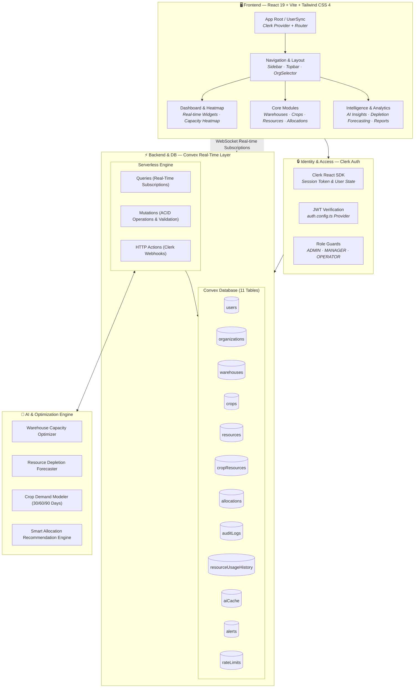

### Authentication & Data Flow

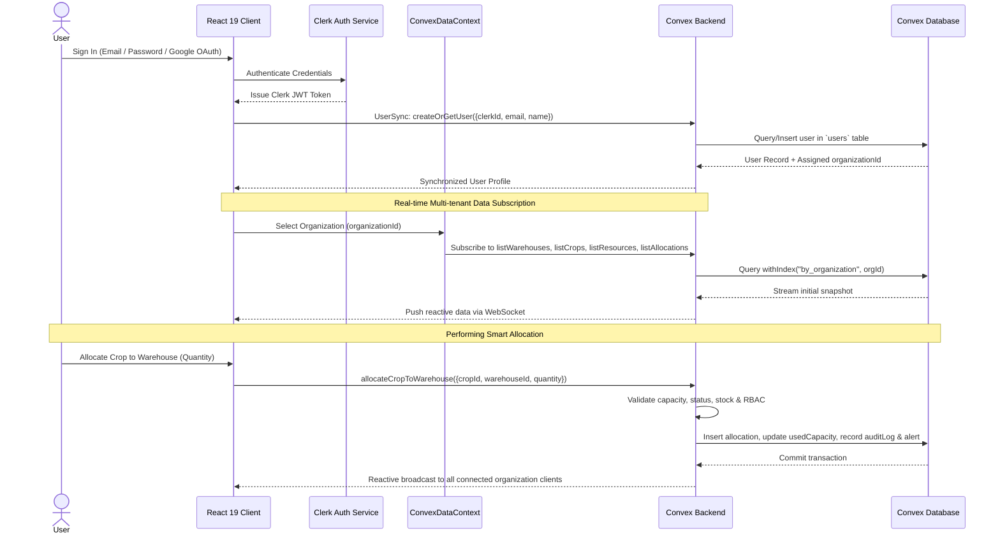

### Multi-Tenant Organization State Machine

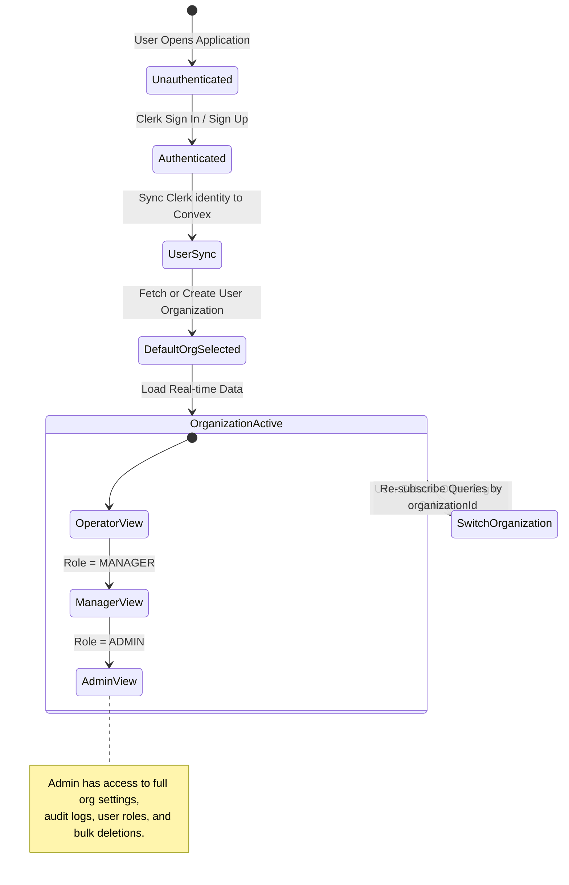

---

## 🗂 UML Class Diagram

The domain model is built on typed schema models with relational indexing managed within the Convex serverless engine. Below is the complete UML representation of the core domain entities, operations, and relationships.

```mermaid
classDiagram
    direction TB

    class UserRole {
        <<enumeration>>
        ADMIN = "ADMIN"
        MANAGER = "MANAGER"
        OPERATOR = "OPERATOR"
    }

    class CropStatus {
        <<enumeration>>
        PLANTED = "PLANTED"
        GROWING = "GROWING"
        HARVESTED = "HARVESTED"
        STORED = "STORED"
    }

    class ResourceType {
        <<enumeration>>
        FERTILIZER = "FERTILIZER"
        PESTICIDE = "PESTICIDE"
    }

    class AlertSeverity {
        <<enumeration>>
        INFO = "info"
        WARNING = "warning"
        CRITICAL = "critical"
    }

    class AlertType {
        <<enumeration>>
        CAPACITY_WARNING = "CAPACITY_WARNING"
        DEPLETION_ALERT = "DEPLETION_ALERT"
        ALLOCATION_COMPLETE = "ALLOCATION_COMPLETE"
        CROP_STATUS_CHANGE = "CROP_STATUS_CHANGE"
        SYSTEM_ALERT = "SYSTEM_ALERT"
        AI_RECOMMENDATION = "AI_RECOMMENDATION"
    }

    class Organization {
        +Id~organizations~ _id
        +String name
        +Number createdAt
        +Number updatedAt
        +createOrganization(name) Id
        +listOrganizations() Array~Organization~
        +getOrganization(id) Organization
    }

    class User {
        +Id~users~ _id
        +String clerkId
        +String email
        +String name
        +UserRole role
        +Id~organizations~ organizationId
        +Number createdAt
        +Number updatedAt
        +createOrGetUser(clerkId, email, name) User
        +updateUserRole(userId, role) Boolean
        +getCurrentUser() User
    }

    class Warehouse {
        +Id~warehouses~ _id
        +String name
        +String location
        +Number totalCapacity
        +Number usedCapacity
        +Id~organizations~ organizationId
        +Number createdAt
        +Number updatedAt
        +createWarehouse(name, location, totalCapacity) Id
        +updateWarehouse(id, data) Boolean
        +deleteWarehouse(id) Boolean
        +getWarehouseUtilization(id) Float
    }

    class Crop {
        +Id~crops~ _id
        +String name
        +Number quantity
        +CropStatus status
        +Id~organizations~ organizationId
        +Number createdAt
        +Number updatedAt
        +createCrop(name, quantity, status) Id
        +updateCropStatus(id, status) Boolean
        +deleteCrop(id) Boolean
    }

    class Resource {
        +Id~resources~ _id
        +String name
        +ResourceType type
        +Number stockQuantity
        +String unit
        +Id~organizations~ organizationId
        +Number createdAt
        +Number updatedAt
        +createResource(name, type, stockQuantity, unit) Id
        +adjustStock(id, delta) Boolean
        +deleteResource(id) Boolean
    }

    class CropResource {
        +Id~cropResources~ _id
        +Id~crops~ cropId
        +Id~resources~ resourceId
        +Number requiredQuantity
        +Number createdAt
        +linkResourceToCrop(cropId, resourceId, quantity) Id
        +unlinkResourceFromCrop(cropResourceId) Boolean
    }

    class Allocation {
        +Id~allocations~ _id
        +Id~crops~ cropId
        +Id~warehouses~ warehouseId
        +Number allocatedQuantity
        +Id~users~ createdBy
        +Id~organizations~ organizationId
        +Number createdAt
        +allocateCropToWarehouse(cropId, warehouseId, quantity) Id
        +deallocate(allocationId) Boolean
    }

    class AuditLog {
        +Id~auditLogs~ _id
        +String action
        +String entityType
        +String entityId
        +Id~users~ performedBy
        +Id~organizations~ organizationId
        +Any details
        +Number timestamp
        +logAction(action, entityType, entityId, details) Id
        +listAuditLogs(organizationId, pagination) Array~AuditLog~
    }

    class ResourceUsageHistory {
        +Id~resourceUsageHistory~ _id
        +Id~resources~ resourceId
        +Number quantityUsed
        +Id~allocations~ allocationId
        +Id~crops~ cropId
        +Id~organizations~ organizationId
        +Number timestamp
    }

    class Alert {
        +Id~alerts~ _id
        +Id~organizations~ organizationId
        +Id~users~ userId
        +AlertType type
        +String title
        +String message
        +AlertSeverity severity
        +String entityType
        +String entityId
        +Boolean read
        +Boolean dismissed
        +Number createdAt
        +createAlert(data) Id
        +markAsRead(alertId) Boolean
        +dismissAlert(alertId) Boolean
    }

    class AICache {
        +Id~aiCache~ _id
        +Id~organizations~ organizationId
        +String cacheKey
        +Any result
        +Number computedAt
        +Number expiresAt
        +getCachedResult(key) Any
        +setCachedResult(key, result, ttl) Boolean
    }

    %% ── Relationships ──
    Organization "1" *-- "*" User : has members
    Organization "1" *-- "*" Warehouse : owns
    Organization "1" *-- "*" Crop : cultivates
    Organization "1" *-- "*" Resource : inventories
    Organization "1" *-- "*" Allocation : manages
    Organization "1" *-- "*" AuditLog : records
    Organization "1" *-- "*" Alert : dispatches
    Organization "1" *-- "*" AICache : caches

    User "1" -- "*" Allocation : creates
    User "1" -- "*" AuditLog : performs

    Crop "1" -- "*" Allocation : assigned to
    Warehouse "1" -- "*" Allocation : stores

    Crop "1" *-- "*" CropResource : requires
    Resource "1" *-- "*" CropResource : supplies

    Resource "1" -- "*" ResourceUsageHistory : consumed in
    Allocation "1" -- "*" ResourceUsageHistory : triggers

    User ..> UserRole : role
    Crop ..> CropStatus : status
    Resource ..> ResourceType : type
    Alert ..> AlertType : type
    Alert ..> AlertSeverity : severity
```

---

## 🛠 Tech Stack

| Layer | Technology | Version | Purpose |
|-------|-----------|---------|---------|
| **Core Framework** | React | 19.2 | Modern concurrent UI architecture, hooks, and suspense |
| **Language** | TypeScript | 5.9 | Full end-to-end strict type safety |
| **Build Tool & Dev Server** | Vite | 7.3 | Lightning-fast HMR and optimized production bundling |
| **Styling** | Tailwind CSS | 4.1 | Modern utility-first CSS design tokens and dark mode |
| **Routing** | React Router | 7.13 | Client-side routing with nested layouts and route guards |
| **Real-Time Backend & DB** | Convex | 1.31 | Reactive serverless database, ACID mutations, WebSocket sync |
| **Authentication & IAM** | Clerk | 5.60 | Multi-tenant auth, session handling, Google OAuth, JWT tokens |
| **Data Visualization** | Recharts | 3.7 | Declarative responsive charts (warehouse util, crop distribution) |
| **PDF Engine** | jsPDF + AutoTable | 4.1 / 5.0 | Client-side styled PDF report generation |
| **Icons** | Lucide React | 0.574 | Accessible SVG icon suite |
| **Testing & Quality** | Playwright + ESLint | 1.58 / 9.39 | End-to-end browser testing, accessibility, and linting |
| **Hosting & Cloud** | Vercel + Convex Cloud | — | Global edge CDN frontend + scalable serverless backend |

---

## 🚀 Getting Started

### Prerequisites

- **Node.js** 18+ ([download here](https://nodejs.org))
- **npm** or **pnpm**
- A [Convex](https://convex.dev/) account (free tier available)
- A [Clerk](https://clerk.com/) account (free tier available)

### Installation

```bash
# 1. Clone the repository
git clone https://github.com/ArrinPaul/Agro-tech.git
cd Agro-tech

# 2. Install dependencies (installs root & frontend dependencies via postinstall)
npm install

# 3. Configure environment variables
cp frontend/.env.example frontend/.env.local
```

### Environment Variables Configuration

Edit `frontend/.env.local`:

```env
# Clerk Publishable Key (from Clerk Dashboard -> API Keys)
VITE_CLERK_PUBLISHABLE_KEY=pk_test_YOUR_CLERK_KEY

# Convex Deployment URL (auto-generated on npx convex dev)
VITE_CONVEX_URL=https://YOUR_DEPLOYMENT.convex.cloud
```

### Configure Clerk JWT for Convex

1. In the **Clerk Dashboard**, navigate to **JWT Templates** → **New Template** → choose **Convex**.
2. Copy the **Issuer URL** provided by Clerk.
3. Create `convex/auth.config.ts` in the project root:

```typescript
export default {
  providers: [
    {
      domain: "https://your-clerk-domain.clerk.accounts.dev",
      applicationID: "convex",
    },
  ],
};
```

### Running the Application

```bash
# Terminal 1: Start Convex Backend (deploys schema, functions & watches for changes)
npx convex dev

# Terminal 2: Start Vite Frontend Server
cd frontend
npm run dev
```

The application will be live at `http://localhost:5173`.

### Available Scripts

| Command | Working Directory | Description |
|---------|-------------------|-------------|
| `npm run dev` | `frontend/` | Start Vite development server with HMR |
| `npm run build` | `frontend/` | TypeScript type-check and Vite production bundle |
| `npm run preview` | `frontend/` | Locally preview the production build |
| `npm run lint` | `frontend/` | Run ESLint across frontend source code |
| `npm run test:e2e` | `frontend/` | Execute Playwright end-to-end tests |
| `npm run test:e2e:ui` | `frontend/` | Launch Playwright interactive test runner |
| `npx convex dev` | Root | Run Convex development backend with live hot-reloading |
| `npx convex deploy` | Root | Deploy Convex functions & schema to production |

---

## 🧩 Features

### 1. Real-Time Intelligence Dashboard

The command center for agricultural operations providing live metrics, capacity heatmaps, and AI suggestions.

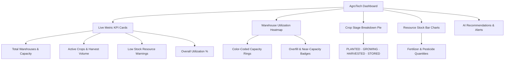

**Key Highlights:**
- **Zero-Polling Reactivity:** All metrics update immediately as allocations or stock levels change across all clients.
- **Utilization Heatmap:** Visual indicators for warehouses below 50% (underutilized), 50-80% (optimal), and >80% (near-capacity).

---

### 2. Smart Warehouse Management

Comprehensive facility tracking with location tagging, strict volume boundaries, and utilization monitoring.

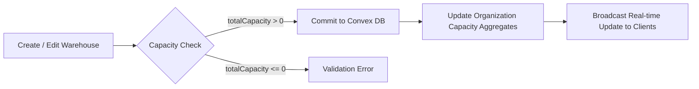

- **Safety Checks:** Warehouses with active crop allocations cannot be deleted until inventory is deallocated.
- **Capacity Calculations:** Dynamic remaining capacity evaluation (`totalCapacity - usedCapacity`).

---

### 3. Crop Lifecycle Management

Full developmental stage tracking from sowing to warehousing.

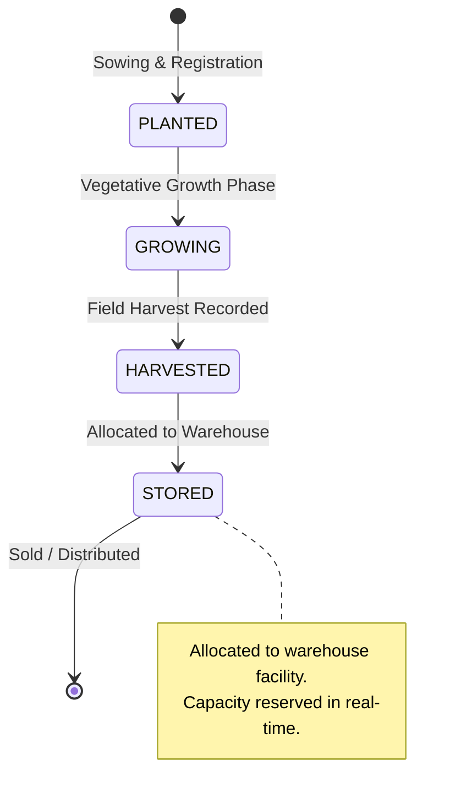

- **Linked Resources:** Define necessary fertilizers and pesticides required per crop cycle.
- **Status Auditing:** Stage transitions automatically trigger immutable audit logs and alert notifications.

---

### 4. Resource & Supply Tracking

Complete chemical, fertilizer, and pesticide inventory control.

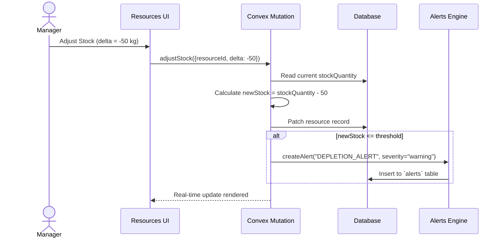

- **Depletion Thresholds:** Automated triggers when fertilizer/pesticide drops below critical operational thresholds.
- **Usage History:** Every allocation logs consumption in `resourceUsageHistory` for velocity predictions.

---

### 5. Smart Allocation Engine

Intelligent crop-to-warehouse mapping with strict capacity and safety validations.

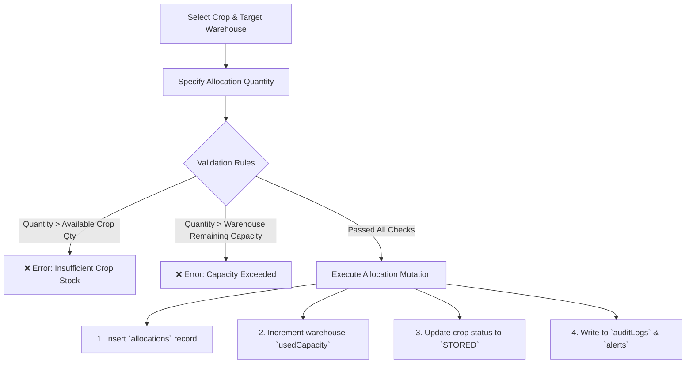

---

### 6. AI & Predictive Optimization Engine

Algorithmic intelligence that actively monitors organization telemetry and generates proactive suggestions.

| AI Feature | Objective | Output |
|------------|-----------|--------|
| **Warehouse Optimization** | Balance storage across facilities | Rebalance suggestions for over/under-utilized warehouses |
| **Depletion Prediction** | Forecast chemical inventory depletion | Estimated run-out days based on recent consumption velocity |
| **Crop Demand Modeler** | Anticipate storage requirements | 30/60/90-day seasonal demand projections |
| **Smart Recommender** | Rank destination warehouses | Top-scored warehouses by proximity, available capacity, and utilization rate |

---

### 7. Immutable Audit Trail

Complete compliance tracking for all administrative and operational actions.

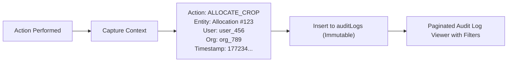

- **Audit Filters:** Filter by organization, entity type (`WAREHOUSE`, `CROP`, `RESOURCE`, `ALLOCATION`), or user.
- **Tamper-Proof:** Audit records have no deletion or modification endpoints.

---

### 8. Multi-Tenant Organization Switcher

Seamless multi-organization governance with complete client-side data isolation.

- **Instant Context Switching:** Switch active farms/facilities with zero reload.
- **Scoped Subscriptions:** All Convex queries dynamically take `organizationId` ensuring zero data leakage.

---

### 9. Real-Time Notification & Alert System

Notification panel with audio-visual alerts and read/dismiss tracking.

- **Alert Categories:** `CAPACITY_WARNING`, `DEPLETION_ALERT`, `ALLOCATION_COMPLETE`, `CROP_STATUS_CHANGE`, `AI_RECOMMENDATION`.
- **Severity Levels:** `info`, `warning`, `critical`.

---

### 10. Reporting & PDF/CSV Export

Comprehensive reporting suite with client-side tabular and graphical PDF rendering via **jsPDF** and **AutoTable**.

- **5 Report Types:**
  1. Warehouse Capacity & Utilization Report
  2. Crop Lifecycle & Production Analysis
  3. Resource Inventory & Depletion Report
  4. Allocation History & Movements
  5. Executive Organization Summary

---

### 11. Bulk Operations & Data Management

- **Bulk CSV Import:** Drag-and-drop CSV importer with field validation and schema error reporting.
- **Batch Actions:** Multi-select for batch status updates, inventory adjustments, and export.

---

## 🔐 Role-Based Access Control (RBAC)

AgroTech enforces a strict 3-tier hierarchical RBAC model verified at both the frontend routing level (`RequireRole` component) and the backend function execution level (`convex/lib/auth.ts`).

### Role Hierarchy

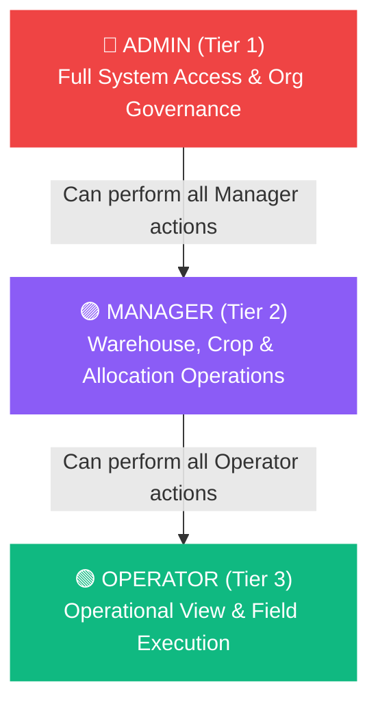

### Permission Matrix

| Operation / Feature | ADMIN | MANAGER | OPERATOR |
|---------------------|:-----:|:-------:|:--------:|
| View Dashboard & Reports | ✅ | ✅ | ✅ |
| View Warehouses, Crops & Resources | ✅ | ✅ | ✅ |
| Execute Crop Allocations | ✅ | ✅ | ✅ |
| Create / Update Warehouses & Crops | ✅ | ✅ | ❌ |
| Adjust Resource Stock | ✅ | ✅ | ❌ |
| Link Resources to Crops | ✅ | ✅ | ❌ |
| Delete Warehouses / Crops / Resources | ✅ | ❌ | ❌ |
| Manage User Roles & Permissions | ✅ | ❌ | ❌ |
| View Full Audit Logs | ✅ | ✅ | ❌ |
| Manage Organization Settings | ✅ | ❌ | ❌ |
| Trigger AI Recalculations | ✅ | ✅ | ❌ |

---

## 🧠 AI & Optimization Engine

### Predictive Analytics Flow

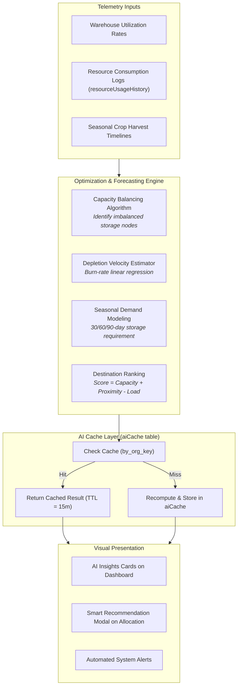

### Depletion Calculation Logic

The depletion predictor computes daily consumption velocity $V$ over historical windows:
$$V = \frac{\sum \text{quantityUsed}}{\Delta t_{\text{days}}}$$
$$\text{Days Remaining} = \frac{\text{Current Stock Quantity}}{V}$$

When $\text{Days Remaining} \le 7$, a high-priority `DEPLETION_ALERT` is pushed to the organization's alert feed.

---

## 🗄 Database Schema (ERD)

The database consists of **11 tables** managed within Convex, leveraging composite indexes for high-speed scoped queries.

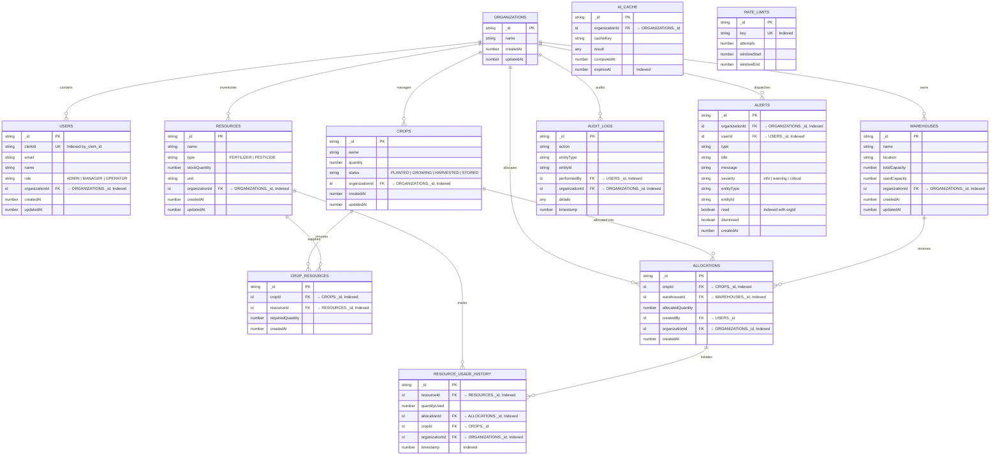

### Database Indexes

| Table | Index Name | Indexed Fields | Purpose |
|-------|------------|----------------|---------|
| `users` | `by_clerk_id` | `[clerkId]` | Clerk authentication lookup |
| `users` | `by_organization` | `[organizationId]` | Retrieve users by tenant |
| `warehouses` | `by_organization` | `[organizationId]` | Scope warehouses to tenant |
| `crops` | `by_organization` | `[organizationId]` | Scope crops to tenant |
| `crops` | `by_status` | `[status]` | Filter crops by lifecycle stage |
| `resources` | `by_organization` | `[organizationId]` | Scope resources to tenant |
| `resources` | `by_type` | `[type]` | Filter fertilizers vs pesticides |
| `cropResources` | `by_crop` | `[cropId]` | Lookup resources needed for crop |
| `cropResources` | `by_resource` | `[resourceId]` | Reverse lookup crops using resource |
| `allocations` | `by_organization` | `[organizationId]` | Scope allocations to tenant |
| `allocations` | `by_warehouse` | `[warehouseId]` | Allocations for specific warehouse |
| `allocations` | `by_crop` | `[cropId]` | Allocations for specific crop |
| `auditLogs` | `by_organization` | `[organizationId]` | Retrieve tenant audit trail |
| `auditLogs` | `by_entity` | `[entityType, entityId]` | Filter audit logs by target entity |
| `alerts` | `by_organization` | `[organizationId]` | Stream tenant alerts |
| `alerts` | `by_read` | `[organizationId, read]` | Unread notifications query |
| `aiCache` | `by_org_key` | `[organizationId, cacheKey]` | AI computation cache lookup |
| `rateLimits` | `by_key` | `[key]` | Fast rate limiting evaluation |

---

## 📡 API Reference

### Convex Queries (Real-Time Subscriptions)

| Function | Arguments | Auth / Role | Description |
|----------|-----------|-------------|-------------|
| `warehouses.listWarehouses` | `{ organizationId }` | Authenticated | Stream all warehouses in organization |
| `warehouses.getWarehouse` | `{ id }` | Authenticated | Fetch specific warehouse details |
| `crops.listCrops` | `{ organizationId, status? }` | Authenticated | Stream crops with optional lifecycle filter |
| `crops.getCrop` | `{ id }` | Authenticated | Fetch single crop record |
| `resources.listResources` | `{ organizationId, type? }` | Authenticated | Stream inventory with optional type filter |
| `resources.getCropResources` | `{ cropId }` | Authenticated | List all resources linked to a crop |
| `allocations.listAllocations` | `{ organizationId }` | Authenticated | Stream all allocations enriched with crop/warehouse details |
| `auditLogs.listAuditLogs` | `{ organizationId, limit?, cursor? }` | `MANAGER+` | Stream paginated audit trail records |
| `reports.getDashboardSummary` | `{ organizationId }` | Authenticated | Aggregated KPIs and chart datasets |
| `reports.getWarehouseReport` | `{ organizationId, dateRange? }` | Authenticated | Detailed warehouse utilization analytics |
| `reports.getCropReport` | `{ organizationId, dateRange? }` | Authenticated | Crop lifecycle distribution data |
| `alerts.listAlerts` | `{ organizationId, unreadOnly? }` | Authenticated | Stream alerts and notifications feed |
| `auth.getCurrentUser` | `{}` | Authenticated | Fetch current user's profile from Clerk token |

### Convex Mutations (ACID Writes)

| Function | Arguments | Auth / Role | Description |
|----------|-----------|-------------|-------------|
| `warehouses.createWarehouse` | `{ name, location, totalCapacity, organizationId }` | `MANAGER+` | Create warehouse facility |
| `warehouses.updateWarehouse` | `{ id, name?, location?, totalCapacity? }` | `MANAGER+` | Edit warehouse parameters |
| `warehouses.deleteWarehouse` | `{ id }` | `ADMIN` | Delete warehouse (validates 0 allocations) |
| `crops.createCrop` | `{ name, quantity, status, organizationId }` | `MANAGER+` | Register new crop batch |
| `crops.updateCropStatus` | `{ id, status }` | `OPERATOR+` | Progress crop lifecycle status |
| `crops.deleteCrop` | `{ id }` | `ADMIN` | Delete crop batch |
| `resources.createResource` | `{ name, type, stockQuantity, unit?, organizationId }` | `MANAGER+` | Add new resource item |
| `resources.adjustStock` | `{ id, delta }` | `MANAGER+` | Increment / decrement chemical stock |
| `resources.linkResourceToCrop` | `{ cropId, resourceId, requiredQuantity }` | `MANAGER+` | Map resource requirements to crop |
| `allocations.allocateCropToWarehouse` | `{ cropId, warehouseId, allocatedQuantity, organizationId }` | `OPERATOR+` | Execute smart allocation with capacity validation |
| `allocations.deallocate` | `{ id }` | `MANAGER+` | Reverse allocation & restore capacity |
| `alerts.markAsRead` | `{ id }` | Authenticated | Mark alert notification as read |
| `alerts.dismissAlert` | `{ id }` | Authenticated | Dismiss alert notification from UI |
| `auth.createOrGetUser` | `{ clerkId, email, name? }` | Authenticated | Synchronize Clerk user identity to Convex |
| `users.updateUserRole` | `{ userId, role }` | `ADMIN` | Change team member RBAC level |

---

## 🛡 Security & Compliance

### Multi-Layer Security Architecture

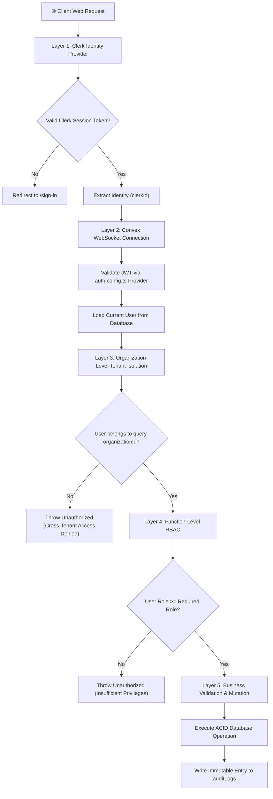

### Security Safeguards

| Safeguard | Implementation Details |
|-----------|------------------------|
| **Multi-Tenant Isolation** | Every database read/write is strictly indexed and verified by `organizationId`. |
| **Clerk JWT Authentication** | Cryptographically verified tokens with zero shared secrets on the frontend. |
| **Tamper-Proof Audit Trail** | All state mutations generate unalterable logs with user ID, timestamps, and payload diffs. |
| **Capacity Overflow Protection** | Atomic backend checks prevent allocation beyond available warehouse volume. |
| **Rate Limiting** | Automated rate limiting on sensitive mutations via the `rateLimits` table. |
| **Security Headers** | Configured in `vercel.json` (`X-Frame-Options: DENY`, `X-Content-Type-Options: nosniff`, `X-XSS-Protection: 1; mode=block`). |
| **Input Sanitization** | Strict schema validation with Convex `v.string()`, `v.number()`, `v.union()`. |

---

## 🎨 Design System

AgroTech utilizes a modern **Agricultural Bio-Emerald** aesthetic with comprehensive light and dark theme support.

### Typography

| Role | Font Family | Usage |
|------|------------|-------|
| **Headings & Display** | Inter / System Sans | Section headers, KPI numbers, modal titles |
| **Body & UI** | Inter / System Sans | Data tables, form labels, buttons |
| **Telemetry & IDs** | JetBrains Mono / Monospace | Audit log IDs, capacity metrics, timestamps |

### Color Palette

| Token | Dark Mode (Default) | Light Mode |
|-------|-------------------|------------|
| **Background** | `#0f172a` (Slate 900) | `#f8fafc` (Slate 50) |
| **Card Surface** | `#1e293b` (Slate 800) | `#ffffff` (Pure White) |
| **Primary Emerald** | `#10b981` (Emerald 500) | `#059669` (Emerald 600) |
| **Warning Amber** | `#f59e0b` (Amber 500) | `#d97706` (Amber 600) |
| **Critical Red** | `#ef4444` (Red 500) | `#dc2626` (Red 600) |
| **Border / Divider** | `#334155` (Slate 700) | `#e2e8f0` (Slate 200) |

---

## 📂 Project Structure

```
Agro-tech/
├── convex/                              # Convex Real-Time Backend
│   ├── _generated/                      # Auto-generated Convex API types
│   ├── lib/
│   │   ├── auth.ts                      # RBAC middleware & identity verification
│   │   └── errors.ts                    # Standardized error definitions
│   ├── schema.ts                        # Database schema (11 tables & indexes)
│   ├── auth.config.ts                   # Clerk JWT provider configuration
│   ├── auth.ts                          # User sync and current user handlers
│   ├── warehouses.ts                    # Warehouse CRUD & utilization calculations
│   ├── crops.ts                         # Crop lifecycle state machine & mutations
│   ├── resources.ts                     # Resource inventory & crop linking
│   ├── allocations.ts                   # Smart allocation engine with validations
│   ├── organizations.ts                 # Multi-tenant organization handlers
│   ├── auditLogs.ts                     # Compliance & audit trail streaming
│   ├── reports.ts                       # Aggregated summary & analytics queries
│   ├── resourceTracking.ts              # Consumption tracking & depletion velocity
│   ├── alerts.ts                        # Notification & alert dispatching
│   ├── aiCache.ts                       # Predictive calculation caching
│   ├── rateLimiting.ts                  # Mutation rate limiting
│   ├── http.ts                          # HTTP actions (Clerk webhook endpoint)
│   └── seed.ts                          # Initial dataset seeder
│
├── frontend/                            # React 19 Frontend
│   ├── e2e/                             # Playwright end-to-end test suites
│   ├── public/                          # Static assets and icons
│   ├── src/
│   │   ├── components/                  # Reusable UI components
│   │   │   ├── charts/                  # Recharts visualization modules
│   │   │   │   ├── AllocationHistoryChart.tsx
│   │   │   │   ├── CropPieChart.tsx
│   │   │   │   ├── ResourceStockChart.tsx
│   │   │   │   └── WarehouseUtilChart.tsx
│   │   │   ├── BulkActions.tsx          # Batch operations toolbar
│   │   │   ├── BulkImport.tsx           # CSV drag-and-drop importer
│   │   │   ├── ConfirmDialog.tsx        # Destructive action modal
│   │   │   ├── ConvexNotificationPanel.tsx # Live alert panel
│   │   │   ├── Modal.tsx                # Accessible modal primitive
│   │   │   ├── OrganizationSelector.tsx # Multi-tenant organization switcher
│   │   │   ├── Pagination.tsx           # Paginated table controller
│   │   │   ├── RequireRole.tsx          # Client-side RBAC route guard
│   │   │   ├── SearchBar.tsx            # Debounced search input
│   │   │   ├── SortableTable.tsx        # Dynamic sortable table
│   │   │   ├── Toast.tsx                # Toast feedback system
│   │   │   └── WarehouseHeatmap.tsx     # Utilization heatmap component
│   │   ├── contexts/                    # React Context providers
│   │   │   ├── AuthContext.tsx          # Clerk session provider
│   │   │   ├── ConvexDataContext.tsx    # Central real-time data coordinator
│   │   │   ├── OrganizationContext.tsx  # Active organization state
│   │   │   └── ThemeContext.tsx         # Dark / light mode state
│   │   ├── layouts/                     # Application shell
│   │   │   └── MainLayout.tsx           # Responsive sidebar + topbar
│   │   ├── pages/                       # Feature pages
│   │   │   ├── AIInsightsPage.tsx       # AI forecasting & optimization views
│   │   │   ├── AllocationsPage.tsx      # Crop allocation manager
│   │   │   ├── AllocationDetailPage.tsx # Single allocation inspector
│   │   │   ├── AuditLogPage.tsx         # Immutable audit viewer
│   │   │   ├── CropsPage.tsx            # Crop inventory & status lifecycle
│   │   │   ├── CropDetailPage.tsx       # Crop detail & linked resources
│   │   │   ├── DashboardPage.tsx        # Real-time intelligence dashboard
│   │   │   ├── LoginPage.tsx            # Clerk login portal
│   │   │   ├── SignUpPage.tsx           # Registration portal
│   │   │   ├── ReportsPage.tsx          # Exportable analytics & PDF generator
│   │   │   ├── ResourcesPage.tsx        # Chemical & fertilizer inventory
│   │   │   ├── WarehousesPage.tsx       # Storage facilities manager
│   │   │   ├── UnauthorizedPage.tsx     # 403 Forbidden holding screen
│   │   │   └── NotFoundPage.tsx         # 404 handler
│   │   ├── types/                       # TypeScript interfaces & types
│   │   ├── utils/                       # Utility functions & PDF exporter
│   │   ├── App.tsx                      # Router configuration
│   │   ├── main.tsx                     # React application entry point
│   │   └── index.css                    # Tailwind CSS 4 theme imports
│   ├── package.json                     # Frontend dependencies & scripts
│   ├── vite.config.ts                   # Vite configuration
│   └── tsconfig.json                    # TypeScript configuration
│
├── vercel.json                          # Vercel deployment configuration
├── package.json                         # Root package configuration
└── README.md                            # Project documentation
```

---

## 🤝 Contributing

We welcome contributions from the agricultural technology, data science, and open-source communities.

### Development Workflow

1. **Fork** the repository
2. **Create** a feature branch: `git checkout -b feature/smart-irrigation-tracker`
3. **Commit** your changes: `git commit -m 'feat: add smart irrigation tracking module'`
4. **Push** to the branch: `git push origin feature/smart-irrigation-tracker`
5. **Open** a Pull Request

### Commit Guidelines

This project strictly follows [Conventional Commits](https://www.conventionalcommits.org/):

| Prefix | Scope / Usage |
|--------|---------------|
| `feat:` | Introducing new capabilities or pages |
| `fix:` | Bug fixes and patches |
| `docs:` | Documentation changes |
| `refactor:` | Code changes that neither fix a bug nor add a feature |
| `perf:` | Performance improvements |
| `test:` | Adding or updating tests |
| `chore:` | Build processes or auxiliary tool changes |

---

<div align="center">

### Built for Resilient Agricultural Supply Chains

**AgroTech Protocol** — Standardizing farm logistics, crop allocations, and warehouse optimization through real-time intelligence.

11 Database Tables · 13 Pages · 20+ Shared Components · Real-Time WebSocket Synchronization · 3-Tier RBAC

</div>
